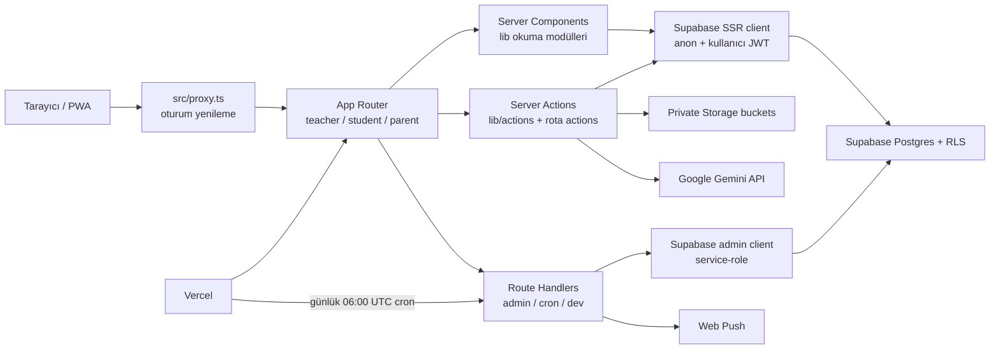

# Ders Takip — yapay zeka ajanı proje indeksi

> Zorunlu başlangıç belgesi. Son yerel doğrulama: **2026-07-21**. Canlı Supabase
> ve Vercel anlık görüntüsü: **2026-07-20, Europe/Istanbul**. Gizli değer içermez.

Bu belge, bir ajanın bütün depoyu tekrar taramadan doğru dosyaya ve doğru güvenlik
katmanına gitmesi için hazırlanmıştır. Bir çelişkide kaynak önceliği şöyledir:

1. Çalışan kaynak kod ve canlı servis şeması/ayarları.
2. `supabase/migrations/` ve yapılandırma dosyaları.
3. Bu indeks.
4. `CLAUDE.md`, `README.md`, `docs/GELISTIRME-PLANI.md`.

İndeks bilinçli olarak gizli değer, kullanıcı verisi ve tam log içermez. Canlı
durum zamanla değişebilir; ilgili bölümdeki yenileme yolunu kullan.

## İlk 60 saniye

- Önce bu dosyayı tamamen oku; sonra yalnız hedef alanın “Ana dosyalar” satırına git.
- Next.js koduna dokunmadan bu kurulu sürümün ilgili rehberini
  `node_modules/next/dist/docs/` altında oku. Proje Next.js `16.2.9` kullanıyor.
- Veri erişiminde varsayılan istemci `src/lib/supabase/server.ts` ve RLS'dir.
  `admin.ts` service-role ile RLS'i aşar; yalnız gerçekten ayrıcalıklı sunucu işi için.
- Şema değişiminde yalnız dosya adına bakıp `db push` çalıştırma. Yerel ve canlı
  migration geçmişi birebir aynı değil; “Migration gerçeği” bölümünü oku.
- Hızlı aramalar:

```powershell
rg -n '\.from\("TABLO"|\.rpc\("FONKSIYON"' src scripts
rg -n 'export async function|"use server"' src/lib/actions src/app
rg -n 'requireRole|assertTeacherAction|requireTeacherApi' src
rg -n 'notifyUsers|sendPushToUsers|revalidatePath|revalidateTag|updateTag|cacheTag' src
rg -n 'process\.env\.' src scripts
rg --files src/app | rg 'page\.tsx$|route\.ts$|actions\.ts$|layout\.tsx$'
```

## Sistem resmi

Uygulama; öğretmen, öğrenci ve veli rolleri için özel ders/LGS takip sistemidir.
Ana özellikler: hesap/rol yönetimi, ödev, kaynak kitap ve test ilerlemesi, takvim,
haftalık çalışma programı, deneme/kazanım analizi, çalışma günlüğü, duyuru,
uygulama içi bildirim, Web Push, yazdırılabilir dönem raporu ve Gemini ile deneme
belgesi içe aktarma. Arayüz, yorum ve kullanıcı hata metinleri Türkçedir.



### Teknoloji ve çalışma zamanı

| Katman      | Gerçek                                                                   |
| ----------- | ------------------------------------------------------------------------ |
| Web         | Next.js App Router `16.2.9`, React/React DOM `19.2.4`, TypeScript 5      |
| Rendering   | Async Server Components; `cacheComponents: true`; PPR/Suspense kabukları |
| UI          | Tailwind CSS 4, shadcn/Radix, Lucide, Sonner, Recharts, Geist            |
| Veri/Auth   | Supabase Postgres 17, Auth, SSR cookie oturumu, RLS, Storage             |
| Dağıtım     | Vercel, GitHub bağlantısı, Node `24.x` üretim runtime                    |
| Entegrasyon | Gemini REST, Web Push/VAPID, Vercel Speed Insights                       |
| Kalite      | ESLint, strict TypeScript, Vitest, Prettier, GitHub Actions              |

## Dizin haritası

| Yol                                  | Sorumluluk                                                          |
| ------------------------------------ | ------------------------------------------------------------------- |
| `src/app/`                           | Rotalar, layout/loading/error sınırları, birkaç rotaya özel action  |
| `src/app/teacher/`                   | Öğretmen deneyimi ve tüm yönetim girişleri                          |
| `src/app/student/`                   | Öğrencinin kendi ödev/kaynak/program/günlük/deneme ekranları        |
| `src/app/parent/`                    | Bağlı öğrenciler için veli ekranları                                |
| `src/app/(print)/rapor/[studentId]/` | Dashboard kabuğu olmadan yazdırılabilir dönem raporu                |
| `src/app/api/admin/`                 | Service-role kullanan hesap yönetimi POST uçları                    |
| `src/app/api/cron/reminders/`        | Vercel cron; hatırlatma + program auto-repeat                       |
| `src/app/api/dev/preview-login/`     | Yalnız development preview otomatik girişi                          |
| `src/components/`                    | Paylaşılan ve domain UI; `ui/` düşük seviye primitives              |
| `src/components/dashboard/`          | Widget registry, veri widget'ları ve özelleştirilebilir düzen       |
| `src/lib/`                           | Okuma modelleri, saf domain mantığı, tipler, auth ve entegrasyonlar |
| `src/lib/actions/`                   | Paylaşılan Server Action mutasyonları                               |
| `src/lib/supabase/`                  | Browser, SSR, middleware ve service-role istemcileri                |
| `src/lib/exams/`                     | Deneme import normalize, öneri ve puan projeksiyonu saf mantığı     |
| `src/test/`                          | Supabase zincir mock'u                                              |
| `supabase/migrations/`               | Şema, RLS, storage, fonksiyon ve indeks niyeti                      |
| `scripts/`                           | İlk admin, preview seed ve preview temizleme yardımcıları           |
| `.github/workflows/ci.yml`           | Lint + format + typecheck + test + build                            |
| `vercel.json`                        | Günlük cron tanımı                                                  |

## İstek, oturum ve yetki akışı

1. `src/proxy.ts`, `src/lib/supabase/middleware.ts` üzerinden Supabase oturum
   cookie'lerini yeniler. `/`, `/login` açıktır; API rotaları kendi kontrolünü yapar.
2. Rol layout'u `DashboardShellGate` içinde `requireRole([role])` uygular. Sayfalar
   çoğunlukla aynı kontrolü tekrar ederek savunma derinliği sağlar.
3. `src/lib/auth.ts#getCurrentProfile`, `auth.getClaims()` ile kullanıcı id'sini
   alır ve `profiles` satırını okur. React `cache()` aynı istekte tekrar sorguyu önler.
4. Sayfa koruması: `requireRole`; öğretmen action koruması:
   `assertTeacherAction`; admin API koruması: `requireTeacherApi`.
5. Asıl satır yetkisi Supabase RLS'dir. Kod içi kontroller RLS'in yerine geçmez.
6. Browser yalnız `NEXT_PUBLIC_SUPABASE_*` ile çalışır. Service role sadece
   `src/lib/supabase/admin.ts` içindedir ve `server-only` ile korunur.

Rol modeli `profiles.role = teacher | student | parent` üzerindedir.
`student_profiles`, öğrenciye özgü uzantıdır; `parent_student_links`, velinin
erişebildiği öğrencileri bağlar. Öğretmende ayrıca `is_admin` ayrıcalık bayrağı,
demo izolasyonu için canlı şemada `profiles.is_demo` vardır.

## Rota haritası

### Ortak ve özel rotalar

- `/`: herkese açık landing; oturumlu kullanıcı proxy tarafından rol köküne gider.
- `/login`: kullanıcı adı teknik e-postaya çevrilir, Supabase password sign-in yapılır.
- `/set-password`: ilk girişte zorunlu şifre değişimi; `actions/account.ts`.
- `/rapor/[studentId]`: öğretmen korumalı yazdırılabilir rapor; `lib/report.ts`.
- Manifest `/manifest.webmanifest`, service worker `/sw.js`; offline cache yok,
  service worker yalnız push alır ve bildirime tıklamayı yönlendirir.

### Öğretmen

- `/teacher`: özelleştirilebilir dashboard.
- `/teacher/students`, `/teacher/students/[studentId]`,
  `/teacher/students/[studentId]/[bookId]`: hesap/link, öğrenci özeti, kitap ilerlemesi.
- `/teacher/homework`, `/teacher/homework/[studentId]`: grup ödev atama, düzenleme,
  kontrol, ek dosya, eksik test yeniden atama.
- `/teacher/resources`, `/teacher/resources/[bookId]`: katalog, onay, bölüm/kazanım,
  zorluk ve öğrenci ilerlemesi.
- `/teacher/calendar`: etkinlik CRUD; rota yanı `actions.ts`.
- `/teacher/schedule`, `/teacher/schedule/[studentId]`: haftalık program.
- `/teacher/exams`, `/teacher/exams/[studentId]`, `/new`, `/[examId]`,
  `/[examId]/edit`: deneme CRUD, belge import, kazanım analizi ve düzenleme talepleri.
- `/teacher/announcements`: hedefli duyuru ve özel storage eki.
- `/teacher/reports`: kullanıcı hata raporları.
- `/teacher/profile`: profil.

### Öğrenci

- `/student`: dashboard.
- `/student/homework`: kendi ödevleri; öğrenci beyan action'ları rota yanındadır.
- `/student/resources`, `/student/resources/[bookId]`: kitaplık ve test ilerlemesi.
- `/student/calendar`, `/student/schedule`: takvim; haftalık programı görüntüleme ve
  kendi adına kayıt ekleme.
- `/student/gunluk`, `/student/gunluk/dokum`: günlük kayıt, seri ve konu dökümü.
- `/student/exams`, `/student/exams/[examId]`: deneme ve kazanım analizi.
- `/student/announcements`, `/student/profile`.

### Veli

- `/parent`: bağlı öğrencilerin dashboard özeti.
- `/parent/homework`, `/parent/resources`, `/parent/resources/[bookId]`.
- `/parent/calendar`, `/parent/schedule`.
- `/parent/exams`, `/parent/exams/[studentId]`, `/new`, `/[examId]`,
  `/[examId]/edit`: RLS ve edit-request akışıyla bağlı öğrenci denemeleri.
- `/parent/announcements`, `/parent/profile`.

Navigasyonun tek ana kaydı `src/components/dashboard-nav.tsx#LINKS_BY_ROLE`;
dashboard widget ana kaydı `src/components/dashboard/registry.tsx`; rol başına izinli
widget id'leri `src/lib/dashboard-layout.ts` içindedir.

## Domain bağlantı matrisi

| Domain        | Ana UI / giriş                           | Okuma ve saf mantık                                                       | Mutasyon                                              | Supabase nesneleri                                                                                      |
| ------------- | ---------------------------------------- | ------------------------------------------------------------------------- | ----------------------------------------------------- | ------------------------------------------------------------------------------------------------------- |
| Kimlik/hesap  | login, set-password, teacher/students    | `auth.ts`, `students.ts`, `username.ts`, `password.ts`                    | `actions/account.ts`, admin API'leri                  | Auth users, `profiles`, `student_profiles`, `parent_student_links`                                      |
| Dashboard     | rol kökleri, `components/dashboard/*`    | `dashboard.ts`, `dashboard-types.ts`, `dashboard-layout.ts`               | `actions/dashboard.ts`                                | Birçok domain tablosu, `dashboard_layouts`, `notifications`                                             |
| Ödev          | teacher/student/parent homework          | `homework-fetch.ts`, `homework.ts`, `homework-parse.ts`                   | teacher ve student rota `actions.ts`                  | `homework`, `homework_tests`, `resource_*`, `student_test_progress`, `homework-attachments`             |
| Kaynak        | role/resources, kitap ilerlemesi         | `books.ts`, `book-catalog.ts`, `resources-parse.ts`, `recommendations.ts` | `actions/resources.ts`                                | `resource_books`, `resource_book_sections`, `student_books`, `student_test_progress`                    |
| Deneme        | role/exams                               | `exams.ts`, `exam-analysis.ts`, `exam-shared.ts`, `kazanim.ts`, `exams/*` | `actions/exams.ts`, `actions/exam-import.ts`          | `exams`, `exam_subjects`, `exam_kazanim_results`, `exam_edit_requests`, `student_profiles.target_score` |
| Takvim        | role/calendar                            | `calendar.ts`                                                             | `teacher/calendar/actions.ts`                         | `calendar_events`, teslim tarihleri için `homework`                                                     |
| Program       | role/schedule                            | `schedule.ts`, `week.ts`                                                  | `actions/schedule.ts`, cron                           | `study_schedule_entries`, `student_profiles.schedule_auto_repeat`                                       |
| Günlük        | student/gunluk, rapor/dashboard özetleri | `study-log.ts`, `study-log-fetch.ts`                                      | `actions/study-log.ts`                                | `study_log`                                                                                             |
| Duyuru        | role/announcements                       | doğrudan SSR sorguları                                                    | `actions/announcements.ts`                            | `announcements`, `announcement_targets`, `announcement-files`                                           |
| Bildirim/push | bell + push toggle + service worker      | `notifications.ts`, `push.ts`                                             | `actions/push.ts`; domain action'ları bildirim üretir | `notifications`, `push_subscriptions`                                                                   |
| Rapor         | `/rapor/[studentId]`                     | `report.ts`, `components/report/*`                                        | yok                                                   | `profiles`, `homework`, `exams` ve ilişkileri                                                           |
| Hata raporu   | global dialog, teacher/reports           | doğrudan SSR                                                              | `actions/bug-reports.ts`                              | `bug_reports`, öğretmen bildirimleri                                                                    |
| AI import     | exam import panel                        | `ai/gemini.ts`, `exams/import-normalize.ts`                               | `actions/exam-import.ts`                              | Kaydetme öncesi dış Gemini çağrısı; dosya kalıcı saklanmaz                                              |

## Server Action ve API yüzeyi

### Paylaşılan Server Action dosyaları

- `actions/account.ts`: ilk şifreyi tamamla ve `must_change_password=false` yap.
- `actions/profile.ts`: kendi profilini güncelle.
- `actions/dashboard.ts`: kullanıcıya özel widget düzenini upsert et.
- `actions/resources.ts`: kitap/bölüm/onay/raf/test ilerlemesi.
- `actions/exams.ts`: tam deneme CRUD, edit request review, hedef puan, analiz fetch.
- `actions/exam-import.ts`: PDF/görsel doğrula → base64 → Gemini JSON → normalize et.
- `actions/schedule.ts`: program CRUD/kopya/bildirim; öğrencinin kendi program kaydı
  ve otomatik devam tercihi, doğrulanmış öğrenci kimliğiyle dar service-role
  işlemleri üzerinden kaydedilir.
- `actions/study-log.ts`: günlük ekle/sil; öğrenci sahipliği veya öğretmen yetkisi.
- `actions/announcements.ts`: hedefleri çöz, duyuru/ek yükle, bildirim ve push üret.
- `actions/bug-reports.ts`: rapor aç/durum değiştir.
- `actions/push.ts`: browser push subscription upsert/delete.

### Route Handler'lar

| Uç                               | Yetki                                               | İstemci      | Ana etki                                                   |
| -------------------------------- | --------------------------------------------------- | ------------ | ---------------------------------------------------------- |
| `POST /api/admin/create-user`    | teacher; öğretmen oluşturmak için ayrıca `is_admin` | service-role | Auth user + profile + öğrenci profili/veli linki           |
| `POST /api/admin/update-user`    | teacher                                             | service-role | profil ve öğrenci uzantısı                                 |
| `POST /api/admin/reset-password` | teacher                                             | service-role | Auth password + zorunlu değişim                            |
| `POST /api/admin/manage-links`   | teacher                                             | service-role | parent-student link ekle/sil                               |
| `POST /api/admin/delete-user`    | teacher; admin kuralları                            | service-role | sahibi silinecek kayıtları öğretmene devret, Auth user sil |
| `GET /api/cron/reminders`        | `Authorization: Bearer CRON_SECRET`                 | service-role | yarınki ödev bildirimi; pazartesi program auto-repeat      |
| `GET /api/dev/preview-login`     | production'da 404 + secret                          | SSR          | preview rol hesabıyla oturum cookie'si                     |

Client admin çağrılarının tek sarmalayıcısı `src/lib/admin-api.ts#postAdmin`.

## Supabase veri haritası

### Canlı proje

- Ad/ref: `takip` / `zngylvsoevmrdhuorszc`; bölge `eu-west-1`;
  durum `ACTIVE_HEALTHY`; Postgres `17.6.1.127`.
- Eski `derstakip` projesi (`eqicmxzqlscvunkuwpzy`) **INACTIVE**; bu depo için
  hedef kabul etme.
- Canlı `public` şemasında 23 tablo var ve hepsinde RLS açık.
- Supabase Edge Function yok. Uygulama backend'i Next.js/Vercel route ve action'larıdır.

### Tablo ilişkileri

- Kimlik omurgası: `auth.users 1—1 profiles`; `profiles 1—1 student_profiles`;
  `parent_student_links(parent_id, student_id)` veli↔öğrenci çoktan çoğa bağlantısıdır.
- Kaynak: `resource_books 1—N resource_book_sections`;
  `student_books` öğrenci↔kitap rafı; `student_test_progress` öğrenci↔bölüm↔test ilerlemesi.
- Ödev: `homework.student_id -> profiles`, opsiyonel `book_id -> resource_books`;
  `homework_tests -> homework + resource_book_sections`; aynı atamanın öğrencileri
  `assignment_group_id` ile gruplanır.
- Deneme: `exams -> profiles(student)`; `exam_subjects -> exams`;
  `exam_kazanim_results -> exam_subjects`; `exam_edit_requests -> exams + profiles`.
- Program/takvim/günlük: `study_schedule_entries`, `calendar_events`, `study_log`
  doğrudan öğrenci profile bağlanır.
- İletişim: `notifications` ve `push_subscriptions` kullanıcıya;
  `announcements` oluşturana, `announcement_targets` duyuru↔öğrenciye;
  `bug_reports` raporlayana bağlıdır.
- Kullanıcı tercihi: `dashboard_layouts.user_id` hem PK hem `profiles` FK'sidir.
- `exam_topics` canlıda durur fakat uygulama kodu kullanmaz; güncel kazanım sistemi
  `exam_kazanim_results` kullanır. Silmeden önce veri/bağımlılık doğrula.

Şemanın uygulama tarafındaki elle yazılmış arayüzleri `src/lib/types.ts` içindedir;
Supabase tarafından generate edilmiş Database tipi yoktur. Canlı `profiles.is_demo`
gibi alanlar bu arayüzlerde eksik olabilir; `types.ts` şemanın eksiksiz kaynağı değildir.

### RLS yardımcıları ve trigger'lar

- `current_role()`: oturum profil rolü.
- `is_parent_of(student)`: parent-student link kontrolü.
- `can_access_student(student)`: öğretmen/kendi/bağlı veli erişimi ve demo izolasyonu.
- `has_approved_exam_edit(exam)`: veli düzenleme talebi kapısı.
- `is_admin()`: öğretmen admin bayrağı.
- `enforce_profile_privilege_guard()`: role/is_admin gibi alanların ayrıcalık koruması.
- `trigger_set_updated_at()`: güncelleme timestamp trigger helper.
- `cleanup_old_homework_attachments()`: eski ödev eklerini storage'dan temizleme.

### Storage

- `homework-attachments`: private; yol biçimi `<homework_id>/<sanitize edilmiş ad>`.
- `announcement-files`: private; duyuru eki.
- Uygulama yükleme sınırı `src/lib/uploads.ts` içinde 10 MiB ve MIME allowlist'tir.
  Canlı bucket metadata'sında ayrıca bucket-level limit/MIME listesi tanımlı değildir.
- İndirme `src/components/attachment-download-button.tsx`; yükleme/silme ilgili
  action'da yapılır. DB işleminden sonra upload başarısızsa satır geri alınır.

### Migration gerçeği — kritik

- Depoda `0001_initial_schema.sql` → `0019_perf_indexes.sql` sıralı dosyaları var;
  `0007` sonrasında `0007b` gelir. README şu anda bunların elle, sırayla uygulanmasını söyler.
- Canlı migration history yalnız timestamp'li 17 kayıt gösterir; ilk kayıt
  `20260704064525_source_books_assignments_redesign` ile başlar ve ayrıca depoda
  aynı adlı dosyası bulunmayan `push_dashboard_reconcile` kaydı vardır.
- Son canlı migration `20260719091533_0019_perf_indexes`; güncel özellik seviyesi
  yerel `0019` ile uyumludur, fakat history birebir değildir.
- Bu nedenle mevcut uzak projeye körlemesine `supabase db push/reset` çalıştırma.
  Önce canlı `list_migrations`, `list_tables` ve gerekiyorsa `db pull/diff` ile drift'i
  incele; yıkıcı reset/branch işlemi için açık kullanıcı onayı al.

### 2026-07-20 advisor anlık görüntüsü — düzeltilmedi

- Güvenlik: `trigger_set_updated_at` için mutable `search_path`; yedi
  `SECURITY DEFINER` helper'ın `anon` ve `authenticated` tarafından executable
  olması; leaked-password protection kapalı. Bu uyarılar indeks oluşturulurken
  yalnız raporlandı, şema değiştirilmedi.
- Performans: 13 unindexed FK, 30 `auth_rls_initplan`, 7 unused index ve 70
  multiple permissive policies uyarısı. Sayılar canlı veriyle değişebilir.
- Yeni DB işi öncesi Supabase Security Advisor ve Performance Advisor'ı yeniden al;
  özellikle helper grant'lerini RLS'in onları nasıl çağırdığıyla birlikte değerlendir.

## Vercel ve üretim haritası

### Canlı proje

- Team: `ssmmgg28's projects` / `team_fCUJqwHvssbuHG5po8kyNMIT`.
- Project: `takip` / `prj_PHLpadTWU8DiqfQU03zXQDqYqSQZ`; framework Next.js;
  GitHub `SsMmGg28/takip` public repo, `main` üretim dalı.
- Vercel runtime Node `24.x`; GitHub Actions Node `20`. Sürüm farkını Node'a özgü
  davranışta hesaba kat.
- 2026-07-20'de son production deployment
  `dpl_CXYxwKjvZ5eqCE4BrrZhfbVKW1VR`, durum `READY`, commit
  `b6c39750b3b7c1d4a8691e3ac53c85257da2e36d`.
- Bilinen domain/alias'lar: `odtmg.vercel.app`, `takip-red.vercel.app`,
  `takip-ssmmgg28s-projects.vercel.app`, `takip-git-main-ssmmgg28s-projects.vercel.app`.
- Yerelde `.vercel/project.json` yok; eşleşme canlı bağlayıcıdan doğrulandı.

### Cron ve build

- `vercel.json`: `GET /api/cron/reminders`, cron `0 6 * * *` (UTC).
- `CRON_SECRET`, Vercel'in gönderdiği bearer token ile route'ta doğrulanır.
- `next.config.ts`: Cache Components açık; `/sw.js` için no-cache header.
- `src/app/layout.tsx`: `@vercel/speed-insights/next` her sayfada.
- CI build'i sahte Supabase env ile çalışır ve gerçek DB'ye ağ çağrısı yapmamalıdır.

### Son 7 günlük runtime hata anlık görüntüsü

- `Invalid Refresh Token: Refresh Token Not Found`: middleware, 8 olay/3 kullanıcı.
- Node `url.parse()` deprecation: iki öğretmen dinamik rotası, 2 olay.
- `Yetkisiz.`: teacher homework dinamik rotası, 1 olay.
- Gemini 503 high-demand: yeni deneme importu, 1 olay.

Bunlar backlog değil, zaman damgalı gözlemdir. Hata işi yapılacaksa Vercel
`get_runtime_errors`/`get_runtime_logs` ile yeniden doğrula.

Vercel bağlayıcısı bu oturumda env değerlerini listelemedi. Aşağıdaki gerekli
anahtar adlarını koddan biliyoruz; Vercel ortamlarında varlık/hedef kapsamı ayrıca
Dashboard veya uygun Vercel env aracıyla doğrulanmalıdır.

## Ortam değişkeni sözleşmesi

| Anahtar                         | Public? | Kullanan yer                              | Yoksa                           |
| ------------------------------- | ------- | ----------------------------------------- | ------------------------------- |
| `NEXT_PUBLIC_SUPABASE_URL`      | Evet    | tüm Supabase istemcileri, scriptler       | uygulama/veri erişimi çalışmaz  |
| `NEXT_PUBLIC_SUPABASE_ANON_KEY` | Evet    | browser, SSR, proxy                       | auth/RLS istemcisi çalışmaz     |
| `SUPABASE_SERVICE_ROLE_KEY`     | Hayır   | admin API, cron, bildirim/push, scriptler | ayrıcalıklı işler çalışmaz      |
| `NEXT_PUBLIC_AUTH_EMAIL_DOMAIN` | Evet    | `username.ts`, seed/admin script          | varsayılan `takip.internal`     |
| `NEXT_PUBLIC_VAPID_PUBLIC_KEY`  | Evet    | push UI + sunucu                          | telefon push UI kapanır         |
| `VAPID_PRIVATE_KEY`             | Hayır   | `lib/push.ts`                             | push gönderimi sessizce kapanır |
| `VAPID_SUBJECT`                 | Hayır   | `lib/push.ts`                             | varsayılan mailto kullanılır    |
| `CRON_SECRET`                   | Hayır   | reminders route                           | cron 401 döner                  |
| `GEMINI_API_KEY`                | Hayır   | `lib/ai/gemini.ts`                        | import UI manuel girişe düşer   |
| `GEMINI_MODEL`                  | Hayır   | Gemini helper                             | `gemini-2.5-flash`              |
| `DEV_PREVIEW_SECRET`            | Hayır   | preview-login                             | dev preview girişi kapanır      |
| `DEV_PREVIEW_PASSWORD`          | Hayır   | preview-login + seed                      | preview hesabı akışı çalışmaz   |

`NEXT_PUBLIC_*` değerler browser bundle'a girer. Service role, VAPID private,
cron, Gemini ve preview sırları asla client component'e veya belgeye taşınmamalıdır.
`DEV_PREVIEW_*` production'da tanımlanmamalı; route ayrıca `NODE_ENV=production`
iken 404 verir.

## Olay, bildirim ve cache bağlantıları

- Domain action'ları önce RLS'li DB mutasyonu yapar, sonra `notifications.ts`
  üzerinden uygulama içi bildirim ve gerektiğinde `push.ts` üzerinden Web Push yollar.
- `notifyUsers`, `notifications` insert eder ve push fan-out'u tamamlayıcıdır;
  push hatası ana işlemi bozmaz. 404/410 subscription'lar admin client ile silinir.
- Öğrenci hedefleri gerektiğinde `getParentIdsByStudent`; öğretmen hedefleri
  `getTeacherIds` ile çözülür. Demo/gerçek kullanıcı izolasyonunu koru.
- Dashboard verisi `src/lib/dashboard.ts`; kişisel düzen `dashboard_layouts`.
- Katalog okumaları `src/lib/books.ts` içindeki `"use cache"` ve `book-catalog`
  tag'iyle ilişkilidir. Kaynak mutasyonlarında ilgili tag/path invalidation'ını ara.
- Cache Components açık olduğundan cookies/params/searchParams kullanan runtime
  veri Suspense sınırları içinde kalmalıdır. Bu sürümün yerel Next docs'unu okumadan
  eski caching API varsayımı yapma.

## Dış entegrasyonlar

- **Gemini:** tek sağlayıcı dokunma noktası `src/lib/ai/gemini.ts`. REST
  `v1beta/models/{model}:generateContent`; temperature 0, JSON schema response.
  `actions/exam-import.ts` PDF/görseli 10 MiB/MIME kontrolünden sonra inline base64
  gönderir; belge Supabase Storage'a yazılmaz. 503 için şu anda otomatik retry yok.
- **Web Push:** `web-push`, VAPID, `public/sw.js`, `push_subscriptions`. PWA'nın
  offline cache özelliği yoktur. iOS'ta ana ekrana ekleme gerekir.
- **Speed Insights:** root layout'ta Vercel bileşeni; iş mantığına bağlı değil.
- **Supabase Auth:** username, `NEXT_PUBLIC_AUTH_EMAIL_DOMAIN` ile teknik e-postaya
  çevrilir. Auth user ve `profiles` satırı birlikte yaşamalıdır.

## Test ve doğrulama

```powershell
npm run lint
npm run format:check
npm run typecheck
npm run test
$env:NEXT_PUBLIC_SUPABASE_URL='https://dummy.supabase.co'
$env:NEXT_PUBLIC_SUPABASE_ANON_KEY='dummy'
$env:SUPABASE_SERVICE_ROLE_KEY='dummy'
$env:NEXT_PUBLIC_AUTH_EMAIL_DOMAIN='takip.internal'
npm run build
```

- Vitest config: `vitest.config.ts`; testler `src/lib/**/__tests__`,
  `src/lib/exams/__tests__`, route action testleri.
- `src/test/supabase-mock.ts` filtreleri gerçek DB gibi uygulamaz; sonuçları tablo
  başına queue eder. Testte dönen veriden çok kaydedilen sorgu şeklini de assert et.
- E2E ve otomatik RLS politika testleri yok. Yetki veya RLS değişiminde unit test
  tek başına yeterli kanıt değildir; canlı olmayan Supabase branch/local stack ile
  rol bazlı sorgu doğrulaması planla.
- Pre-commit `simple-git-hooks` → `lint-staged`; TS/TSX/MJS için ESLint+Prettier,
  JSON/MD/CSS için Prettier.

## Bilinen keskin kenarlar

- `src/lib/types.ts` generated değil ve canlı şemayı eksiksiz temsil etmiyor.
- Yerel migration adları Supabase CLI timestamp standardında değil; canlı history
  baseline/reconcile içeriyor. Migration işlemini otomatik varsayma.
- `admin.ts` açıklaması dar görünse de cron, push, duyuru fan-out ve kullanıcı silme
  de kullanır. Yeni kullanımı eklerken bu indeks ve dosya açıklamasını güncelle.
- `proxy.ts` yalnız session/erken yönlendirme katmanıdır; nihai authorization
  sayfa/action/API + RLS'te tekrar doğrulanmalıdır.
- `/teacher/calendar`, `/teacher/schedule*`, `/teacher/students*` bazı dosyalarda
  doğrudan `requireRole` görünmese bile öğretmen layout'u tarafından korunur.
  Taşıma/refactor sırasında layout korumasını kaybetme.
- Vercel Node 24 ile CI Node 20 farklıdır.
- Supabase advisor uyarıları çözülmüş sayılmamalı; bu indeks yalnız kaydeder.
- `supabase/config.toml` seed olarak `supabase/seed.sql` bekliyor, fakat bu dosya
  depoda yok. `supabase db reset` öncesi bunu çözmeden yerel resetin başarılı
  olacağını varsayma.

## İndeksi güncel tutma protokolü

Aşağıdakilerden biri değişirse aynı PR/çalışmada bu dosyayı güncelle:

- Yeni/silinen rota, layout, action, API veya navigasyon öğesi.
- Yeni/silinen tablo, kolon, FK, RLS policy, function, trigger, bucket veya migration.
- Env anahtarı, dış API, cron, Vercel runtime/domain veya deploy akışı.
- Auth/rol modeli, service-role kullanımı, bildirim/cache invalidation akışı.
- Test komutları veya önemli bilinen boşluklar.

Yalnız yerel değişiklik yaptıysan üstteki “Son yerel doğrulama” tarihini güncelle.
Canlı Supabase/Vercel araçlarını gerçekten sorguladıysan canlı tarihini ve ilgili
proje/deployment/advisor bilgilerini güncelle. Gizli değer ve ham kullanıcı verisi
ekleme. Son olarak `npm run format:check -- docs/AGENT-INDEX.md AGENTS.md` yerine
deponun desteklediği `npx prettier --check AGENTS.md docs/AGENT-INDEX.md` komutuyla
Markdown biçimini doğrula.
